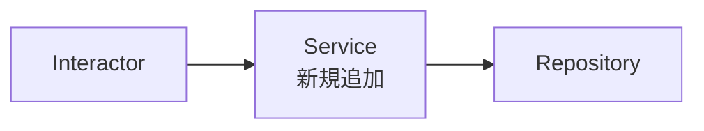

# PR本文の視覚化指針

PR本文は **視覚優先** で構成する。<br/>
散文を最小限にし、表・Mermaid図・見出しで構造的に提示することで、レビュアーが一目で変更の全体像を把握できる状態を作る。

PR本文は GitHub Flavored Markdown でレンダリングされる。`.md` ファイル一般のルール（`.agents/skills/shared-references/markdown-writing-rules.md`）とは改行の扱いが異なる点に注意する。

---

## 句点で改行する

1セクション内で文章が複数文になる場合は、句点（`。`）の直後に改行を入れる。<br/>
レビュアーが文単位で視線を区切れるようにするため。

GFMでは行末の改行がそのまま `<br>` として反映されるため、タグは不要。逆に `<br/>` を付けると空行が挿入されて読みづらくなる。

```markdown
%% OK — 改行のみ
標定ロジックを汎用Service化した。
従来は各カード効果クラスに重複していた座標計算を共通化する目的。

%% NG — 1行に詰め込まれている
標定ロジックを汎用Service化した。従来は各カード効果クラスに重複していた座標計算を共通化する目的。

%% NG — <br/>を付けると空行が入る
標定ロジックを汎用Service化した。<br/>
従来は各カード効果クラスに重複していた座標計算を共通化する目的。
```

---

## 図表を優先する

散文の箇条書きで列挙するより、**表** か **Mermaid図** で表現できないかを必ず検討する。

| 変更の性質 | 推奨表現 |
|---|---|
| 複数ファイル・複数機能の修正を整理 | 表（修正対象 × 種別 × 内容） |
| 新規追加と削除が混在 | 表（追加/削除/変更 の列分け） |
| クラス・モジュール間の依存関係の変化 | Mermaid `graph` 図 |
| 状態遷移・ライフサイクルの変化 | Mermaid `stateDiagram` |
| 処理フロー・シーケンスの変化 | Mermaid `sequenceDiagram` |
| 設定値・パラメータの変更 | 表（項目 × 変更前 × 変更後） |
| 単純な小規模変更（1〜2点） | 箇条書きで可 |

---

## 「概要」と「変更内容」の役割分担

`概要` は **目的・なぜ**、`変更内容` は **何を・どう** を担当する。<br/>
同じ情報を抽象度違いで2度書かない。

| セクション | 答える問い | 粒度 |
|---|---|---|
| 概要 | なぜこの変更が必要か | 1〜2文 |
| 変更内容 | 何がどう変わったか | 図表で構造的に |

---

## 表現パターン例

### パターンA: 変更内容の整理表

複数の修正を1表に集約する。

```markdown
## 変更内容

| 対象 | 種別 | 内容 |
|---|---|---|
| `PieceHealthService.cs` | 追加 | ダメージ計算メソッドを追加 |
| `PieceHealthProvider.cs` | 変更 | 戻り値型を `int` → `Health` に変更 |
| `PieceHealthTests.cs` | 追加 | 上記2点のテストケース追加 |
```

### パターンB: Mermaid図で構造を示す

依存関係・状態遷移・処理フローの変化を視覚化する。

````markdown
## 変更内容

従来は各Interactorが直接Repositoryを参照していたが、Service層を挟む構造に変更した。


````

### パターンC: 変更前後の対比表

設定値・パラメータ・型定義の変更を示す。

```markdown
## 変更内容

| 項目 | 変更前 | 変更後 |
|---|---|---|
| `CooldownSeconds` | 3.0 | 1.5 |
| `MaxStack` | 5 | 10 |
| `DamageRatio` | 0.8 | 1.0 |
```

### パターンD: 小規模変更の箇条書き

1〜2点の単純な修正のみの場合は箇条書きでよい。

```markdown
## 変更内容

- typo修正: `Recive` → `Receive`
- 不要な `using` を削除
```

---

## 作業分担行

```
🤖 AI: {AIの担当内容} / 👤 Human: {人間の担当内容}
```

- AI・人間それぞれの担当内容を1行で簡潔にまとめる
- 具体的な作業内容を書く（「実装」「レビュー」のような抽象語だけにしない）
- 例: `🤖 AI: コメント付与・コード修正 / 👤 Human: 方針決定・レビュー`
- 例: `🤖 AI: 調査・分析 / 👤 Human: 設計・実装`
