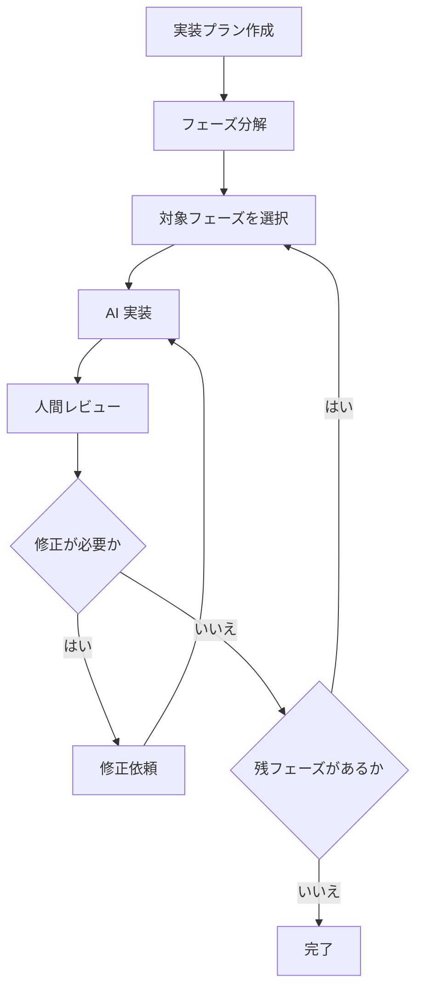
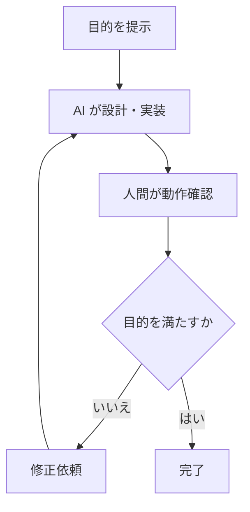
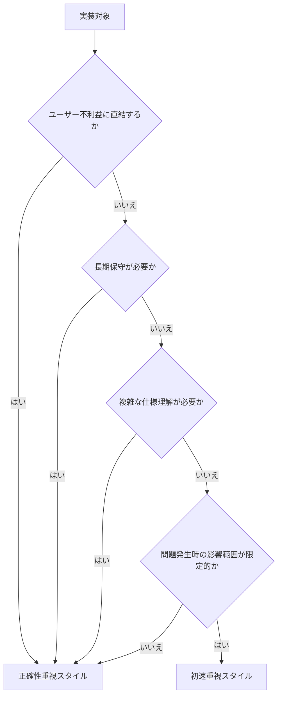

# 実装でのAI活用方針

実装では、AI に委ねる範囲を一律には定めず、対象のリスク、保守性、影響範囲に応じて開発スタイルを切り替えます。 

## 開発スタイル

実装時の AI 活用方針は、大きく以下の2パターンに分けます。 

### 正確性重視

AI の実装支援を利用しつつ、設計整合性、仕様理解、デバッグ容易性を人間が厳密に確認するスタイルです。 
このスタイルでは実装ルールを細かく定義することで **「すべてのコードをリードエンジニアが直接実装したかのような状態」** を理想形として目指します。 

> [!NOTE] 
> メリット
> - 設計意図や実装ルールを保ったまま AI の実装支援を取り込める
> - 長期保守や不具合調査に耐えやすい実装にしやすい
> - レビュー時に設計判断や例外ケースを確認しやすい

> [!WARNING] 
> デメリット
> - 人間側の確認項目が多い（人間側がボトルネックとなりやすい）
> - 実装完了までの時間が長くなりやすい（手動実装と比較すると速いが、後述の初速重視スタイルと比較すると遅い）

### 初速重視（バイブコーディング）

本資料では **「設計から実装までを AI に委ね、人間側は動作確認のみ行う」** ことをバイブコーディングと定義します。 
人間側の確認粒度を抑えることで、初速を優先するスタイルです。 

> [!NOTE] 
> メリット
> - 設計検証や作業補助に必要な実装を短時間で用意できる
> - 試行錯誤の回数を増やしやすい

> [!WARNING] 
> デメリット
> - 設計整合性や保守性の確認が薄くなりやすい
> - 複雑な仕様を実装させた場合、意図と異なる出力になりやすい
> - 修正指示だけでは解決できない不具合が生じた場合、調査が難航しやすい

## 判断フロー

上記2つの方針は、実装対象のリスク、保守性、問題発生時の影響範囲、仕様理解の難度に応じて使い分けます。 
基本的には、ユーザー不利益に直結する領域、長期保守が必要な領域、複雑な仕様理解が必要な領域では正確性重視スタイルを採用します。 
影響範囲を限定でき、仕様も単純な領域では初速重視スタイル（バイブコーディング）を採用します。 

## 具体例

本プロジェクトでは、具体的に以下のように開発スタイルを振り分けます。 

| 対象 | 開発スタイル | 採用理由 |
|---|---|---|
| 共通処理・基盤処理 | 正確性重視 | 設計の崩れが複数機能へ波及する |
| ゲーム本体の実装 | 正確性重視 | 仕様理解、設計整合性、デバッグ容易性が継続的に必要になる |
| 複雑な遊び仕様の実装 | 正確性重視 | 仕様意図の解釈違いがゲーム体験に直結する |
| 課金・セキュリティ・ユーザーデータ | 正確性重視 | 不具合がユーザー不利益や信頼低下に直結する |
| セーブデータ・進行状態 | 正確性重視 | 不具合発生時の復旧コストが大きい |
| 一時的な作業補助ツール | 初速重視 | 問題発生時の影響を限定しやすく、手戻りの範囲も小さい |
| 検証用スクリプト | 初速重視 | 完成度よりも検証速度を優先しやすい |

## 判断基準の背景

以下の経験から、対象領域ごとにレビュー粒度を変える方針を採用しています。 

### 事例1: 不具合修正指示の行き詰まり

レビュー粒度を抑えて AI に実装を委ねた際、不具合修正の過程で別の不具合が混入することがありました。 
「修正して」とだけ指示を出すとその場しのぎの対応が重なり、結果として設計の整合性が崩れ、修正のたびに別の問題が発生しやすくなると感じています。 

そのため長期運用するコードやユーザー体験に直結するコードでは、設計整合性とデバッグ容易性を人間が確認する必要があると判断しました。 

### 事例2: 仕様認識の限界

ゲームの遊びに関わる複雑な仕様を AI に実装させた際、意図と異なる成果物になることがありました。 
要因の一つは仕様書の記述粒度が十分ではなかったことですが、プロトタイプ段階では仕様書を先に作り込むことが常に最適とは限りません。 
特に「遊び」部分は作って試すループを短く回すことが重要だと考えています。 

実装フェーズを小さく分解し、CLI 上で AI と対話しながら進める方が、結果的に早く仕上がる場合が多いと判断しました。 

> [!NOTE] 
> Unity によるゲーム実装を基準にした方針です。 
> Web 開発など別分野では適切な判断基準が異なる可能性があります。 

> [!NOTE] 
> Opus 4.7 / GPT-5.5 までの利用経験を前提としています。 
> AI の性能向上によって解決する可能性があるため、判断基準は継続的に更新する必要があると考えています。 
