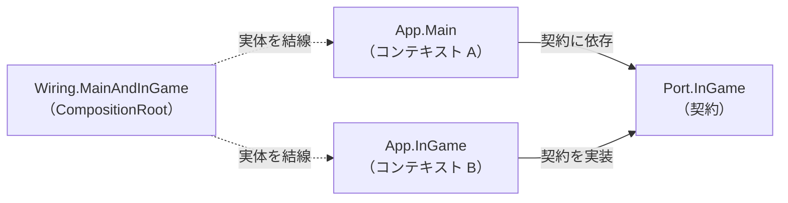
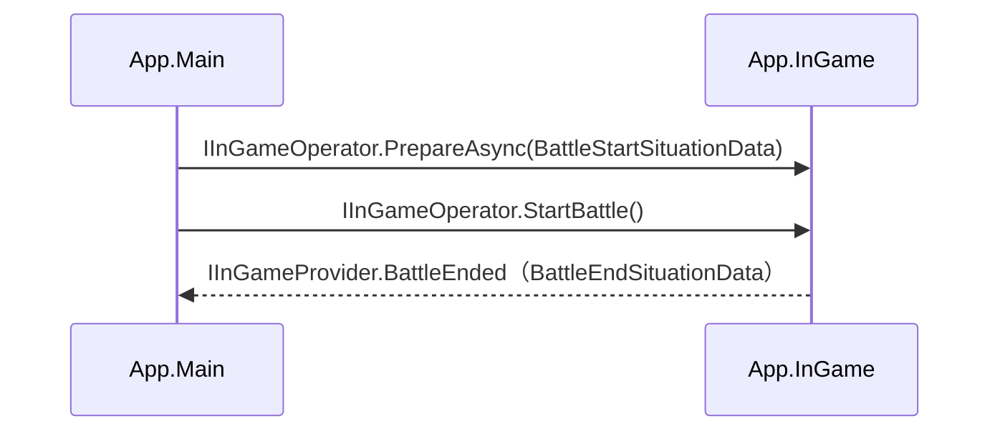

# コンテキスト分割

## 目次

- [概要](#概要)
- [モジュール＝コンテキスト境界](#モジュールコンテキスト境界)
- [Port（コンテキスト間の契約）](#portコンテキスト間の契約)
  - [Port が隔離するもの](#port-が隔離するもの)
  - [Wiring による結線](#wiring-による結線)
  - [具体例](#具体例)
- [採用しない範囲](#採用しない範囲)
- [関連](#関連)

## 概要

コンテキスト分割は、採用アーキテクチャの DDD「境界づけられたコンテキストの発想」を具体化したものです。 
本PJでは、機能のまとまりであるモジュールを、それぞれが固有のドメインモデルを持つ「境界づけられたコンテキスト」として扱います。 
コンテキスト間でやり取りが必要な箇所だけを契約として切り出し、その契約を専用のモジュール（Port）に隔離することで、各コンテキストの内部を互いから独立させます。

## モジュール＝コンテキスト境界

[レイヤー構成](layer-structure.md) で述べたとおり、各モジュールは自分専用の副層スタック（Domain〜SequenceRoot）を独立して持ちます。 
このうち Domain を独立して持つことが、モジュールをコンテキスト境界たらしめます。 
同じ概念であっても、モデルの形・粒度・不変条件はコンテキストごとに最適化され、内部に閉じます。

Project 層には、例えば次のようなモジュールが置かれます。

| モジュール | コンテキストの役割 |
|---|---|
| App.Main | アウトゲーム（メニュー・編成・進行など）の実行文脈 |
| App.InGame | インゲーム（バトル進行）の実行文脈 |
| Foundation.MasterData | 不変設定データのコンテキスト |
| Foundation.UserData | プレイヤーの進行・所持情報のコンテキスト |
| Foundation.Networking | 通信のコンテキスト |
| Foundation.Shared | 複数コンテキストが共有する基盤 |

App.Main と App.InGame は、それぞれが独自の Domain（Entities / ValueObjects / Services / Repositories）を持ちます。 
両者は実行文脈もモデルも異なるため、互いの内部へ直接踏み込むことはせず、後述の Port を介してのみやり取りします。

> [!NOTE] 
> モジュールの Domain が他モジュールの Domain しか参照しないという依存ルールは [レイヤー構成](layer-structure.md) で機械的に強制しています。 
> 本ページでは同じ仕組みを「コンテキスト境界」の観点から捉え直しています。 
> 境界を越える依存をアセンブリ参照で縛ることが、コンテキストの独立を構造として守ることに直結します。

## Port（コンテキスト間の契約）

2つのコンテキストが連携する必要がある場合、その契約だけを取り出した専用モジュールを設けます。 
App.Main と App.InGame の連携を担うのが Port.InGame モジュールです。 
Port には連携に必要な最小限の取り決めだけを置き、各コンテキストの内部実装は一切含めません。

### Port が隔離するもの

Port.InGame が隔離しているのは、次の2種類です。

| 隔離対象 | 内容 | 実例 |
|---|---|---|
| 操作インターフェース | コンテキストを操作・観測するための窓口 | `IInGameProvider`（観測）、`IInGameOperator`（操作） |
| 境界をまたぐデータ | コンテキスト間で受け渡す状況データ（不変の ValueObject） | `BattleStartSituationData`、`BattleEndSituationData` |

操作インターフェースは、状態の観測と操作を別々のインターフェースに分けています。 
`IInGameProvider` が状態の観測（Observable の公開）を担い、それを継承する `IInGameOperator` が操作を担います。 
インターフェースの実体は App.InGame 側のクラスが実装し、Port には契約のみが置かれます。

> [!NOTE] 
> この「読み取り（Provider）と操作（Operator）を分ける」考え方は本PJ共通のパターンで、[ドメインモデリング](domain-modeling.md) でも同様に用いています。

境界をまたぐデータは、コンテキスト間の受け渡し専用に定義した不変の ValueObject です。 
「戦闘を開始するにあたり何が決まっていればよいか」「戦闘の結果として何が確定したか」といった、境界で合意した情報だけを Port の語彙で表現します。 
これにより、呼び出し側・呼び出され側のどちらの内部モデルにも依存しない受け渡しが成立します。

### Wiring による結線

App.Main と App.InGame は、互いを直接参照しません。 
両者はともに Port.InGame（契約）だけに依存し、実体の結線は Wiring.MainAndInGame モジュールが CompositionRoot として担います。 
Wiring が App.InGame 側の実装を Port のインターフェースとして解決し、App.Main へ手渡すことで、2つのコンテキストの相互参照を避けつつ疎通させます。

> [!NOTE] 
> 矢印はコンパイル時の依存方向です。 
> A・B はどちらも Port にのみ依存し、互いを参照しません（A→B も B→A もありません）。 
> 実行時にどの実体をインターフェースへ割り当てるかは、破線で示した Wiring が一手に引き受けます。

### 具体例

ここまでの Port（隔離）と Wiring（結線）を具体化すると、次のようなやり取りになります。

App.Main は起動情報（`BattleStartSituationData`）を `IInGameOperator` 経由で渡して進行を操作し、結果（`BattleEndSituationData`）を `IInGameProvider` の通知で受け取ります。 
App.Main が扱う `IInGameOperator` は、Wiring が App.InGame 側の実装を解決して渡したものです。 
やり取りする型は Port が定める契約のみで、互いの内部モデルには踏み込みません。

## 採用しない範囲

DDD の戦略的設計には、コンテキストマップやサブドメイン分類（コア／支援／汎用ドメイン）といった形式的な道具立てがあります。 
本PJではこれらを明示的な成果物としては採用せず、「境界づけられたコンテキストの発想」という考え方だけを取り入れています。

> [!NOTE] 
> コンテキストマップやサブドメイン分類は、複数チーム・複数システムにまたがる境界の調停を主目的とする道具です。 
> 本PJはゲーム単一PJであり、チーム間の境界調停が主要課題ではないため、形式的な道具立てまでは導入していません。 
> 境界そのものはモジュール（アセンブリ）の分割として既に構造化されており、発想を実装に落とし込む手段としてはこれで十分と判断しています。

## 関連

- [採用アーキテクチャ（README）](../README.md)
