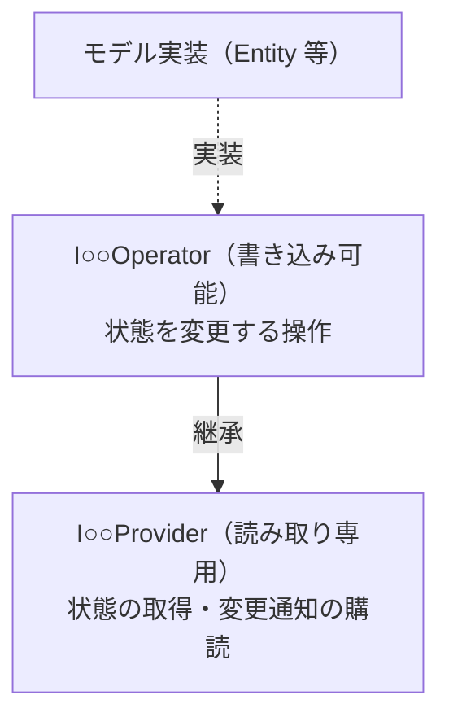

# ドメインモデリング

## 目次

- [概要](#概要)
- [構成要素](#構成要素)
- [読み書き分離（Provider / Operator）](#読み書き分離provider--operator)
- [値の型による表現](#値の型による表現)
- [集約を明示しない方針](#集約を明示しない方針)
- [関連](#関連)

## 概要

ドメインモデリングは、採用アーキテクチャの DDD（戦術的な構成要素）を具体化したものです。 
Domain 層のモデルを Entities / ValueObjects / Services / Repositories という構成要素で表現し、対象領域の知識をコードの構造として写し取ります。 
本ページでは、各構成要素を本PJがどう具体化しているか、そして読み書き分離（Provider / Operator）という本PJ独自パターンを示します。

## 構成要素

Domain 層は DDD の戦術的構成要素ごとにフォルダ（アセンブリ）を分け、それぞれを次の役割で実装します。

| 構成要素 | 役割 | 特徴 |
|---|---|---|
| Entity | 識別子で同一性を判定するモデル | 識別子を持ち、状態が変化しうる |
| ValueObject | 値で同一性を判定するモデル | 属性の同値で等価判定、生成後は不変（get-only・ファクトリ生成） |
| Service | 特定のエンティティに属さないドメインロジック | 状態を持たず、複数のモデルにまたがる計算を担う（取得は Repository 経由） |
| Repository | 永続化・外部取得を抽象化する窓口 | Domain にインターフェースを置き、実装は Infrastructure に置く |

> [!NOTE] 
> 構成要素ごとのフォルダ分割はアセンブリ（asmdef）境界と一致します。 
> これにより構成要素間の参照関係もコンパイル時に縛られ、分類が構造として守られます。

## 読み書き分離（Provider / Operator）

本PJでは、モデルの状態へアクセスするインターフェースを **読み取り専用の Provider** と **書き込み可能な Operator** に分離します。 
Operator は Provider を継承するため、書き込み権を渡すと読み取り権も自動的に付随し、逆に読み取り権だけを渡すこともできます。 
利用側には必要最小限の権限のインターフェースだけを公開することで、誰がどのモデルを変更しうるかをインターフェースの型で制約します。

- Provider: 状態の取得と変更通知（Observable）の購読のみを公開
- Operator: Provider を継承し、状態を変更する操作を追加で公開
- モデル実装は Operator を実装し、利用側へは用途に応じて Provider / Operator のいずれかで渡す

たとえば状態を表示するだけの利用側には Provider を渡し、状態を変更する側にだけ Operator を渡します。 
これにより「読むだけのはずの箇所が誤って書き換える」事故を、実行時ではなくコンパイル時に排除できます。

> [!NOTE] 
> Provider / Operator は DDD の用語ではなく、本PJ独自の命名・パターンです。 
> 読み取り権と書き込み権をインターフェースの継承関係で分け、最小権限の原則を型で強制することを狙いとしています。

## 値の型による表現

ID やパラメータといった「ただの値」も、専用の ValueObject 型として表現します。 
たとえばマスターデータの識別子は `○○DataId` という型で表し、生の文字列や数値のまま持ち回りません。 
これにより、異なる種類の ID を取り違える誤用がコンパイル時に弾かれ、引数の意味も型名から読み取れるようになります。

- ID は種類ごとに別の型として定義し、相互に代入できないようにする
- 値の妥当性検証（不正な値を弾く処理）を型のコンストラクタに閉じ込め、不正な値のインスタンスが存在しないことを保証する
- 生成後は不変とし、値の同値で等価判定する

> [!NOTE] 
> プリミティブ型のまま値を持ち回ると、引数の順序間違いや別種 ID の混入をコンパイラが検出できません。 
> 値を型で表すことで、ドメイン上意味の異なる値どうしの混同を構造的に防ぎます。

## 集約を明示しない方針

本PJでは、DDD の集約（Aggregate）を表す専用の型は設けていません。 
整合性の境界は、Entity が内部にもつ状態と、それを変更できる Operator の公開範囲によって表現します。 
状態変更の窓口を Operator に集約し、外部には Provider しか見せないことで、不変条件を保つ責務をモデル自身に閉じ込めています。

> [!NOTE] 
> 集約という枠組みを型として導入する代わりに、読み書き分離で「誰が状態を変更できるか」を制約する方針を採っています。 
> パターンを形式的に網羅するのではなく、本PJの規模と Unity 実装に対して効果のある概念だけを選んで取り入れています。

## 関連

- [採用アーキテクチャ（README）](../README.md)
- [レイヤー構成](layer-structure.md) … メタ層・副層・依存方向の全体構造
- [コンテキスト分割](context-split.md) … モジュール（コンテキスト）境界と Port
- [UI構成](ui-structure.md) … MVRP による UI とドメイン状態の同期
