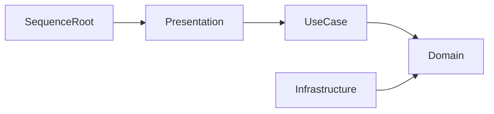
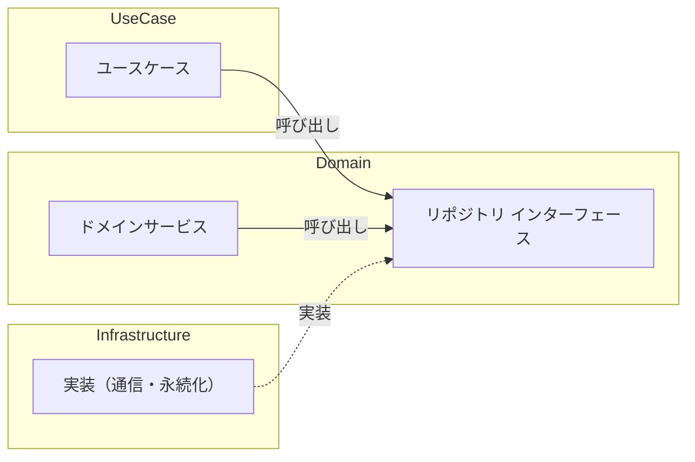
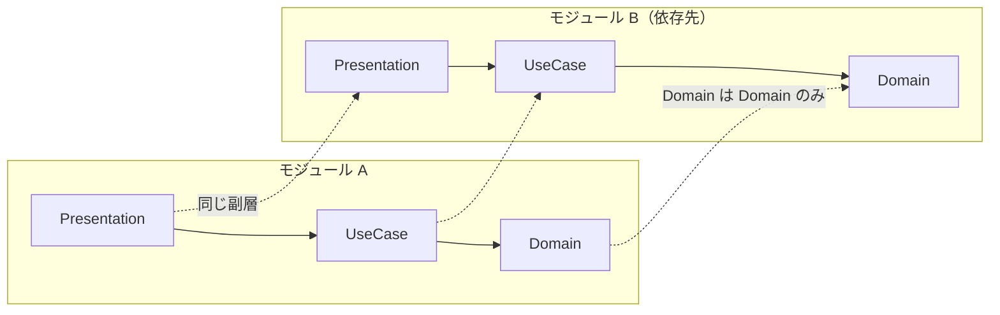

# レイヤー構成

## 目次

- [概要](#概要)
- [依存の機械的な強制](#依存の機械的な強制)
- [アセンブリ命名と3階層のレイヤー](#アセンブリ命名と3階層のレイヤー)
  - [メタ層](#メタ層)
  - [モジュール](#モジュール)
  - [副層](#副層)
- [依存方向](#依存方向)
  - [Repository による依存逆転](#repository-による依存逆転)
  - [モジュール間の依存](#モジュール間の依存)
- [層の純粋性ルール](#層の純粋性ルール)
- [各層の由来まとめ](#各層の由来まとめ)
- [関連](#関連)

## 概要

本ページは、本PJのコードが実際にどのようなレイヤーで構成されているかを示します。<br/>
このレイヤー構成は単一のアーキテクチャに由来するものではなく、**クリーンアーキテクチャの依存方向のルール、DDD のレイヤードアーキテクチャと戦術的な構成要素、本PJ独自の層**を組み合わせた合成物です。<br/>
そのため本ページでは「どの層がどのアーキテクチャ由来か」を明示することに主眼を置きます。

## 依存の機械的な強制

本PJでは、レイヤーの区切りを **アセンブリ（asmdef）の境界** として実装しています。<br/>
アセンブリ間の参照関係で依存方向を縛ることで、レイヤーの依存ルールをコンパイル時に機械的に強制します（違反はビルドエラーになります）。<br/>
口頭やレビューに頼る規約ではなく、構造として守られる仕組みです。

## アセンブリ命名と3階層のレイヤー

全アセンブリは次の命名規則に従います。

```
Hecres.<メタ層>.<モジュール>.<副層>
```

この名前は、**メタ層**・**モジュール**・**副層**の3階層に対応します。<br/>
全体像は次のとおりです。

```
メタ層（Core / Frameworks / Project）
└─ モジュール（機能のまとまり）
   └─ 副層
      ├─ Domain
      ├─ UseCase
      ├─ Infrastructure
      ├─ Presentation
      ├─ CompositionRoot
      └─ SequenceRoot
```

以降、各層を順に説明します。

### メタ層

再利用性による大分類です。

| メタ層 | 役割 |
|---|---|
| Core | Unity に依存しない汎用ライブラリ（純粋な C#） |
| Frameworks | Unity に依存する汎用ライブラリ |
| Project | 本PJ固有のコード（共有基盤・各アプリ実行文脈など） |

**判断軸**: 「他プロジェクトでも再利用できるか」「Unity に依存するか」の2軸で配置を決めます。<br/>
迷う場合はまず Project に置き、再利用が必要になった時点で Frameworks / Core へ昇格させます。<br/>
これにより、過剰な共通化を避けます。

### モジュール

機能のまとまりの単位です。<br/>
各モジュールは自分専用の副層スタック（Domain〜SequenceRoot）を独立して持ちます。

例として、Frameworks 層には音響・入力・ローカライズ・UI といった汎用的な基盤機能が置かれます。<br/>
Project 層には、アプリの大きな実行文脈ごとに本PJ固有の処理を担うモジュールが置かれます。

また、Frameworks 層の基盤を継承して本PJ独自の基盤を作る場合もあります（マスターデータなど）。

### 副層

モジュール内部の責務分割です。<br/>
すべての副層を常に置くわけではなく、必要になったものだけを置きます。

| 副層 | 役割 |
|---|---|
| Domain | ドメインモデル・ビジネスルール |
| UseCase | ユースケース実行単位 |
| Infrastructure | 外部システム統合（通信・永続化・ファイル） |
| Presentation | UI・入力（MonoBehaviour） |
| CompositionRoot | DI 設定・依存関係の結線 |
| SequenceRoot | シーン／シーケンスのライフサイクル管理 |

このうち Presentation / UseCase / Domain / Infrastructure の4層構成は、DDD（Eric Evans）のレイヤードアーキテクチャに由来する枠組みです。<br/>
DDD で **Application 層** と呼ばれる層は、Unity では「Application」という語が紛らわしいため、本PJでは **UseCase** と呼称しています（役割は Application ＝ UseCase です）。<br/>
CompositionRoot・SequenceRoot は、この4層に本PJが追加した独自の副層です。

Domain の内部はさらに DDD の戦術的構成要素ごとに分割されます。

```
Domain/
├ Entities       … 識別子で同一性を判定するモデル
├ ValueObjects   … 値で同一性を判定する不変モデル
├ Services       … 特定のエンティティに属さないドメインロジック
└ Repositories   … 永続化を抽象化する取得・保存の窓口（インターフェース）
```

## 依存方向

依存は常に内側（Domain）へ向かいます。<br/>
クリーンアーキテクチャの依存性のルールそのものです。



- 上位層から下位層への参照のみ可、逆方向は禁止
- 層をまたぐ依存はインターフェース経由（依存性逆転）

> [!NOTE]<br/>
> 矢印は依存の向き（内側の Domain へ）を表します。<br/>
> 見やすさのため、図は隣接する層への主要な依存のみを示します（より内側への直接参照、例: SequenceRoot → Domain は省略）。<br/>

> [!NOTE]<br/>
> CompositionRoot は全層の結線（実行時の依存解決）を担うため、この図には含めていません。

### Repository による依存逆転

外部システム（通信・永続化など）へのアクセスは、Domain 側に置いたインターフェース（Repository サブ層）を介します。<br/>
実装は Infrastructure に置き、実行時に CompositionRoot が注入します。<br/>
これにより実装の詳細である Infrastructure が抽象である Domain に依存する形になり、依存の向きは内側に保たれます。



### モジュール間の依存

モジュール間に依存関係がある場合も、副層は内向きのルールを保ちます。<br/>
あるモジュールの副層は依存先モジュールの **同じ副層か、より内側の副層** だけを参照できます。<br/>
特に Domain は、他モジュールであっても Domain しか参照しません（外側の UseCase / Infrastructure / Presentation には依存しません）。



> [!NOTE]<br/>
> 破線はモジュールをまたぐ参照です。<br/>
> より内側への参照（例: A の UseCase が B の Domain を参照）も可能ですが、外側への参照（例: A の Domain が B の UseCase を参照）はできません。

## 層の純粋性ルール

Domain・UseCase を外部フレームワークから独立させるため、ライブラリの参照を次のように制限します。

| ライブラリ | Domain / UseCase | Presentation / Infrastructure / CompositionRoot / SequenceRoot |
|---|---|---|
| 純粋な C# / System | ◯ | ◯ |
| R3（Reactive） | ◯ | ◯ |
| UniTask（非同期） | ◯ | ◯ |
| UnityEngine の値型（Vector3 / Quaternion 等） | ◯（下記の例外） | ◯ |
| MonoBehaviour / GameObject | ✕ | ◯ |
| VContainer（DI） | ✕ | ◯ |

- **R3 / UniTask**: 非同期・リアクティブは Domain にも浸透するため許可（締め出すと UseCase に変換層が増える）
- **VContainer**: DI 属性が Domain に漏れると純粋性が崩れるため排除、結線は CompositionRoot に集約
- **UnityEngine 値型**: 座標・回転・方向はドメインの本質要素のため、値型に限り許容

> [!NOTE]<br/>
> MonoBehaviour / GameObject の ✕ は「依存の機械的な強制」の例外で、規約による制約にとどまります。<br/>
> 値型のために UnityEngine を参照する以上、同じアセンブリにある MonoBehaviour / GameObject も技術的には参照できてしまい、値型だけを参照する手段がないためです。<br/>
> このためここだけは、「MonoBehaviour を継承しない」「GameObject / Transform を使わない」といった規約で守っています（VContainer は別アセンブリのため、参照しないことで機械的に排除できます）。

## 各層の由来まとめ

レイヤー構成の各部分がどのアーキテクチャに由来するかを次の表にまとめます。

| 由来 | 該当する層・構造 |
|---|---|
| クリーンアーキテクチャ | - 依存を内向き一方向に保つ依存性のルール・依存性逆転<br/>- Application 層の「UseCase」という呼称 |
| DDD（Eric Evans） | - Presentation / Application / Domain / Infrastructure の4層構成<br/>- Domain 内部の Entities・ValueObjects・Services・Repositories への分割 |
| 本PJ独自 | - メタ層・モジュール層の構成<br/>- CompositionRoot・SequenceRoot の副層 |

「同心円の図」に固定の層名・層数があるわけではなく、本PJはこの3者を合成して独自のレイヤー構成を定義しています。

## 関連

- [採用アーキテクチャ（README）](../README.md)
