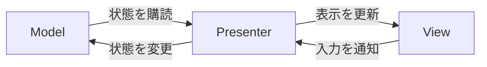

# UI構成

## 目次

- [概要](#概要)
- [構成要素](#構成要素)
- [データフロー](#データフロー)
- [購読ライフサイクルの管理](#購読ライフサイクルの管理)
- [関連](#関連)

## 概要

UI構成は、採用アーキテクチャの MVRP（Model-View-Reactive Presenter）を具体化したものです。<br/>
Model の状態変化を Presenter が購読し、View に反映することで、ドメインの状態と UI をリアクティブに同期させます。

## 構成要素

Model・View・Presenter の3者で構成します。

| 要素 | 役割 | 実装 |
|---|---|---|
| Model | 状態を保持し、変化を Observable で公開 | ドメイン層のオブジェクト（読み取りは Provider 経由で受け取る） |
| View | 表示と入力受付に専念し、ロジックを持たない | UI コンポーネント（MonoBehaviour） |
| Presenter | Model の購読と View 更新の仲介 | `MvrpPresenterBase<TModel>` を継承した MonoBehaviour |

Presenter は View への参照を `[SerializeField]` で保持し、Model から受け取った値を View へ渡します。<br/>
Presenter にドメインロジックは置かず、購読と反映だけに徹します。

> [!NOTE]<br/>
> Presenter にロジックを書けるようにすると肥大化して「Presenter という名の Controller」に退化します。<br/>
> ロジックが必要になったら Model 側へ押し戻すのが原則です。

## データフロー



上段（Model → Presenter → View）が中心の流れで、Model の変化が自動的に View へ伝わります。<br/>
入力を伴う UI では下段（View → Presenter → Model）も使い、状態変更は Model 側に反映します。

## 購読ライフサイクルの管理

Presenter は専用の購読トークン `MvrpRxToken`（CancellationToken）を持ち、Observable の購読をこれに紐づけます。

```csharp
Model.Value.Subscribe(value => view.Apply(value)).AddTo(MvrpRxToken);
```

ライフサイクルは次の流れで管理します。

- 初期化: `InitializeModelLinkAsync` で Model を紐づけ、現在値を View に初期反映
- 購読開始: `LinkMvrpRxAsync` で Observable を購読（`MvrpRxToken` に AddTo）
- 購読解除: `UnlinkMvrpRx` で購読を破棄（`OnDestroy` で自動実行）

> [!NOTE]<br/>
> 購読を `MvrpRxToken` に紐づけることで、Presenter の破棄や Model の差し替え時に購読が自動解除されます。<br/>
> これにより購読解除漏れによるメモリリーク・二重通知を構造的に防ぎます。

## 関連

- [採用アーキテクチャ（README）](../README.md)
