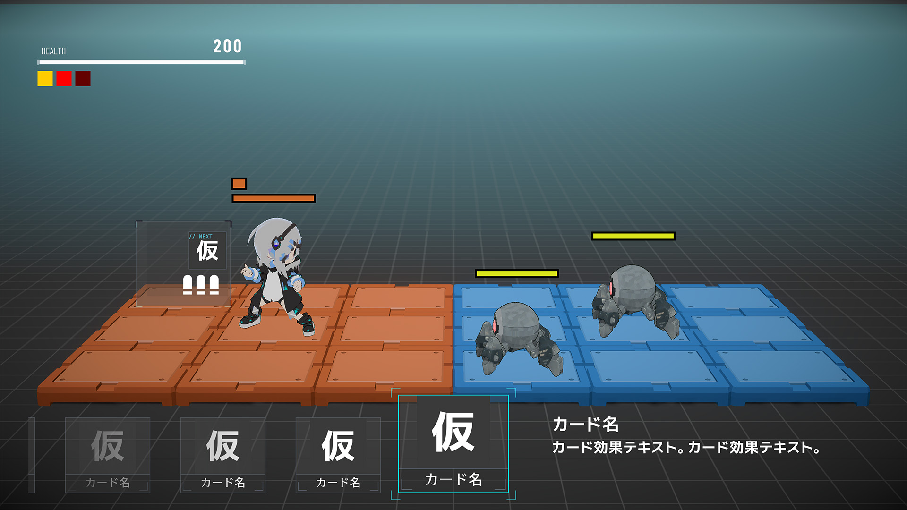
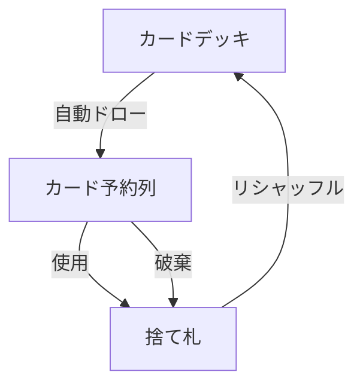

# プレイヤーユニット

## 概要

プレイヤーが操作する戦闘ユニット固有の仕様。共通仕様は[戦闘ユニット（非公開資料）](../../private-notice.md)を参照。

---

## モックアップ

---

## ゲーム進行

バトルはフェーズ分けを行わず、全てリアルタイムで進行する。 
バトル開始直後からカード予約列が上限まで揃った状態でカード使用が可能。サイドアームも即座に使用可能。

---

## 操作一覧

| 操作 | 備考 | XBOXコントローラー | キーボード |
|------|------|-------------------|-----------|
| 移動 | バトルフィールド上で移動させる | 十字キー/左スティック | WASD |
| サイドアーム使用 | 前方に自動連射する（押しっぱなし） | R1 | TAB（切り替え式） |
| カード使用 | カード予約列先頭のカードを発動する | X | SPACE |
| カード破棄 | カード予約列先頭のカードを捨て札に送る | B | Q |
| リロード | 使用回数を復活させる | Y（2連打） | E |

---

## サイドアーム

- サイドアーム使用ボタン押しっぱなしで前方に自動連射する（操作の詳細は[操作一覧](#操作一覧)を参照）
- 移動可能だが、移動のたびに連射が途切れる（定位置の方がDPSが高い）
- チャージショットなし
- カード使用時およびリロード中はサイドアームが中断される
- カード発動後、サイドアーム使用ボタンを押し続けていればサイドアームは自動復帰する
- デフォルトは射撃攻撃だが[装具効果（非公開資料）](../../private-notice.md)により別行動に換装可能

---

## バトル中のカードデッキ運用

> **ゲームルール仕様**: [カードデッキ構築ルール（非公開資料）](../../private-notice.md)を参照

### カード予約列

- カードデッキから引かれたカードが `【カード予約列の上限○枚】` 分、画面上にカード予約列として常時表示される
- 先頭が現在使用可能なカード、残りが次以降に来るカード
- カードデッキ残量が上限未満の場合、カード予約列はカードデッキ残量分のみ表示される

### カード使用

- カード予約列先頭のカードを発動する
- 使用回数を1消費する
- カード予約列が1つ進み、カードデッキから次の1枚が列の末尾に補充される

### カード破棄

- カード予約列先頭のカードを使用せず捨て札に送る
- カード予約列が1つ進む
- `【破棄を○回すると使用回数1回分の消費が発生する】`

### カードデッキリシャッフル

- カードデッキが空になりカード予約列も使い切った後、プレイヤーがリシャッフルを実行してカードデッキを復活させる
- 代償として `【リシャッフル時に最大HPの○分の○を失う】`（暫定: 3分の1）
- 現在HPには影響しない（最大HPのみ減少）
- 回復カードは復活するが、減少した最大HPを超えて回復はできない
- 最大HPは1未満にはならない（生存している限りリシャッフルは何度でも可能）

| リシャッフル回数 | 最大HP（元を100とした場合） | 状態 |
|---|---|---|
| 0 | 100 | 通常 |
| 1 | 66 | 圧迫 |
| 2 | 44 | 危険 |
| 3+ | 1 | 一撃死 |

> **設計意図: リシャッフル** 
> - カードデッキを使い切るほど追い詰められるが、腕前で粘れる構造（[1.1 追い詰められながら上達していく体験](../../spec-principles.md#11-追い詰められながら上達していく体験)）
> - リシャッフルするかどうかはプレイヤー自身の選択（[2.3 プレイヤー自身の選択による制約](../../spec-principles.md#23-プレイヤー自身の選択による制約)）
> - HP満タンの熟練プレイヤーほど損失が大きい非対称性（[5.2 習熟度による非対称性](../../spec-principles.md#52-習熟度による非対称性)）

### カードの状態遷移

---

## リロード

- 任意のタイミングでリロード操作が可能（使用回数が残っていても実行できる）
- リロード操作で `【使用回数カウンターを○回分取得】` する（ただし `【使用回数カウンターの上限○回】` を超えての取得はできない）
- リロード中は移動不可、サイドアーム中断の `【○秒の無防備時間が発生】` する
- リロード時、`【リロード解除耐性を持たないエンチャント】` が全て解除される
    - エンチャントはバフ・デバフ両方を含む統一概念
    - リロードタイミング遅延によるバフ維持戦略や、早めのリロードによるデバフ解除戦術が成立する
- カード予約列の位置・内容には影響しない

> **設計意図: リロード** 
> - リロード中の無防備時間はプレイヤー自身がタイミングを選んだ結果である（[2.3 プレイヤー自身の選択による制約](../../spec-principles.md#23-プレイヤー自身の選択による制約)） 
> - バフ維持のためにリロードを遅らせるか、デバフ解除のために早めにリロードするかの判断を迫る（[2.1 面白さの源泉](../../spec-principles.md#21-面白さの源泉)）

---

## 被弾時の影響

- 被弾してもカード周り（カード予約列、使用回数）には一切影響しない

> **設計意図: 被弾時のカード保護** 
> - 被弾によるカード没収や使用回数減少といった操作妨害を排除し、プレイヤーのストレスを判断で迫る形に限定する（[3.2 操作妨害の回避](../../spec-principles.md#32-操作妨害の回避)）
