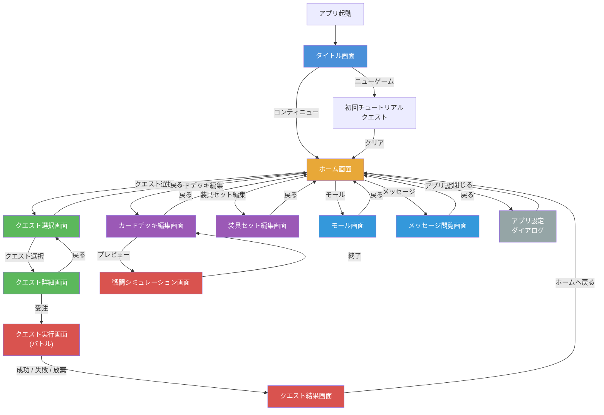
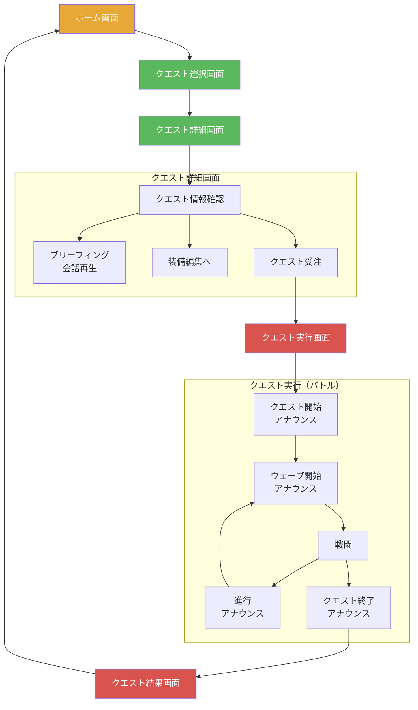
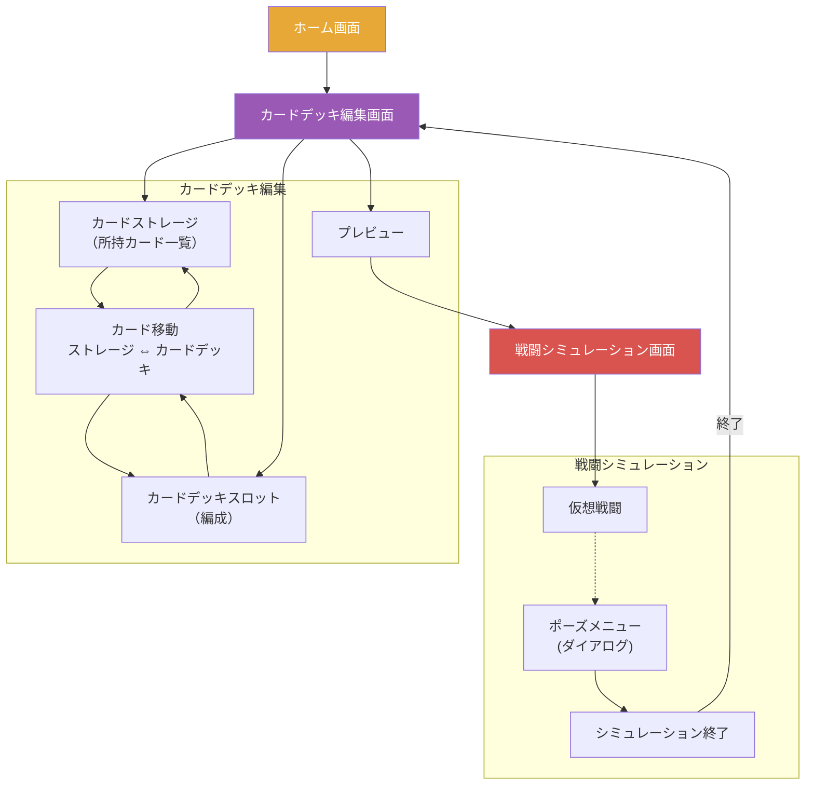
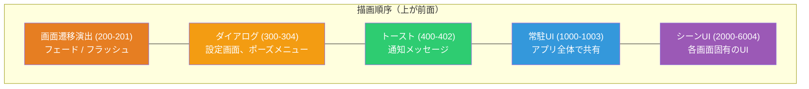

# 画面遷移図

アプリケーション全体の画面遷移フローを図示します。

---

## 全体遷移フロー

> **仕様補足: 凡例** 
> - 実線矢印: ユーザー操作による遷移

> **仕様補足: シミュレーション→カードデッキ編集の遷移** 
> 戦闘シミュレーション → カードデッキ編集の遷移は、内部的には Home 画面を経由し自動遷移で復帰する。

> **技術補足: シミュレーション→カードデッキ編集の遷移** 
> `HomeManagerArgs(CardDeckEditManagerArgs)` のネスト引数パターンで実現する。

---

## クエスト攻略フロー（詳細）

---

## カードデッキ編集・プレビューフロー

> **仕様補足: シミュレーション終了時の遷移** 
> シミュレーション終了 → カードデッキ編集への遷移は、内部的には Home 画面を経由した自動遷移で実現される。 
> ユーザーからは直接カードデッキ編集画面に戻るように見える。

---

## UIレイヤー構造

画面は複数のキャンバスレイヤーで構成されています。数値が小さいほど前面に表示されます。

---

## 各画面の仕様書へのリンク

| 画面名 | 説明 | 仕様書 |
|--------|------|--------|
| タイトル画面 | アプリ起動後の最初の画面。ロゴ表示後にニューゲーム/コンティニューを選択 | [タイトル画面（非公開資料）](private-notice.md) |
| ホーム画面 | メインハブ画面 | [ホーム画面（非公開資料）](private-notice.md) |
| クエスト選択画面 | チャプター/クエスト一覧 | [クエスト選択（非公開資料）](private-notice.md) |
| クエスト詳細画面 | クエスト情報の詳細確認・受注 | [クエスト詳細（非公開資料）](private-notice.md) |
| クエスト実行画面 | バトルプレイ画面 | [クエスト実行（非公開資料）](private-notice.md) |
| インゲーム画面 | バトル画面の全体構成 | [インゲーム画面](ui/screens/spec-ingame.md) |
| クエスト結果画面 | クリア報酬の確認 | [クエスト結果（非公開資料）](private-notice.md) |
| カードデッキ編集画面 | カードデッキの構築 | [カードデッキ編集](ui/screens/spec-card-deck-edit.md) |
| 装具セット編集画面 | 装具の編成 | [装具セット編集（非公開資料）](private-notice.md) |
| モール画面 | ゲーム内ショップ | [モール（非公開資料）](private-notice.md) |
| メッセージ閲覧画面 | 受信メッセージの閲覧 | [メッセージ閲覧（非公開資料）](private-notice.md) |
| 会話画面 | 会話データのオーバーレイ再生（HecTalk） | [会話画面（非公開資料）](private-notice.md) |
| 戦闘シミュレーション画面 | カードデッキのプレビュー戦闘 | [戦闘シミュレーション（非公開資料）](private-notice.md) |
| アプリ設定ダイアログ | 各種設定の変更 | [アプリ設定（非公開資料）](private-notice.md) |
