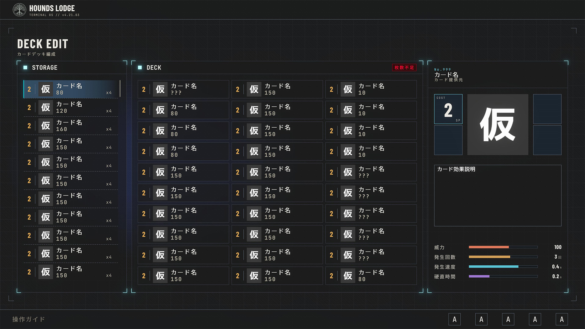
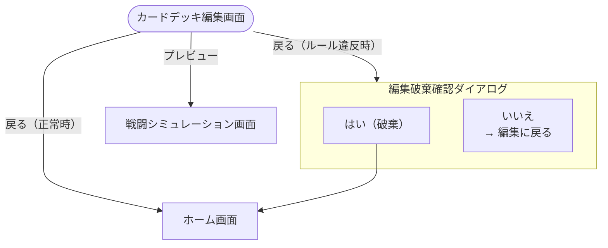

# カードデッキ編集画面

## 概要

カードデッキの構築を行う画面。 
画面は左右分割構成で、左側にカードストレージ（所持カード一覧スクロールリスト）、右側にカードデッキスロット（固定リスト）が配置される。 

> **ゲームルール仕様**: [カードデッキ構築ルール（非公開資料）](../../private-notice.md)

---

## モックアップ

---

## フロー

---

## 操作・遷移一覧

### カード選択

| 操作 | 入力 | 備考 | 遷移先 |
|------|------|------|--------|
| ストレージ内カード選択 | [決定キー（非公開資料）](../../private-notice.md) | カードをデッキの空きスロットへ移動（オートセーブ実行） | - |
| カードデッキ内カード選択 | [決定キー（非公開資料）](../../private-notice.md) | カードをストレージへ戻す（カード移動エフェクト再生、オートセーブ実行） | - |
| カードフォーカス | [方向キー（非公開資料）](../../private-notice.md) | フォーカスカード詳細にカード情報を表示 | - |
| グループフォーカス左 | [グループ切替キー（左）（非公開資料）](../../private-notice.md) | フォーカスをストレージ側へ切り替える | - |
| グループフォーカス右 | [グループ切替キー（右）（非公開資料）](../../private-notice.md) | フォーカスをカードデッキ側へ切り替える | - |

### その他

| 操作 | 入力 | 備考 | 遷移先 |
|------|------|------|--------|
| フィルタソートメニュー表示 | [メニューキー（非公開資料）](../../private-notice.md) | - | [カード用フィルタソートダイアログ（非公開資料）](../../private-notice.md) |
| プリセット保存 | [プリセット保存キー（非公開資料）](../../private-notice.md) | 保存モードのプリセット選択ダイアログを表示 | [カードデッキプリセット保存ダイアログ（非公開資料）](../../private-notice.md) |
| プリセット読込 | [プリセット読込キー（非公開資料）](../../private-notice.md) | 読込モードのプリセット選択ダイアログを表示 | [カードデッキプリセット読込ダイアログ（非公開資料）](../../private-notice.md) |
| プレビュー | [決定キー（非公開資料）](../../private-notice.md) | - | [戦闘シミュレーション画面（非公開資料）](../../private-notice.md) |
| 戻る（正常時） | [キャンセルキー（非公開資料）](../../private-notice.md) | - | [ホーム画面（非公開資料）](../../private-notice.md) |
| 戻る（ルール違反時） | [キャンセルキー（非公開資料）](../../private-notice.md) | 編集破棄確認ダイアログを表示 | [アラートダイアログ（非公開資料）](../../private-notice.md) |

---

## UI要素一覧

### 共通UI

| 要素名 | 説明 | 参照 |
|--------|------|------|
| シーケンスタイトル | 画面名称の表示（ヘッダー固定） | [シーケンスタイトル表示（非公開資料）](../../private-notice.md) |
| 操作案内 | コンテキストに応じた操作ガイド（フッター固定） | [操作案内表示（非公開資料）](../../private-notice.md) |

### 画面固有UI: カードデッキ編集

| 要素名 | 説明 |
|--------|------|
| カードストレージ一覧 | 所持カードのスクロールリスト |
| カードデッキスロット一覧 | カードデッキの30スロット固定リスト |
| フォーカスカード詳細 | 現在フォーカスしているカードの詳細情報（カード表示：非公開資料） |
| カード移動エフェクト | カードがカードデッキ/ストレージ間を移動する際のエフェクト |
| 構築ルール違反表示 | カードデッキがゲームルール上の要件を満たさない場合に未達条件を表示する |

### 画面固有UI: ダイアログ・オーバーレイ

| 要素名 | 説明 | 参照 |
|--------|------|------|
| カード用フィルタソートダイアログ | カードストレージのフィルタ/ソート条件を設定するダイアログ | [カード用フィルタソートダイアログ（非公開資料）](../../private-notice.md) |
| 編集破棄確認ダイアログ | ルール違反状態で画面離脱時に表示される確認ダイアログ | [アラートダイアログ（非公開資料）](../../private-notice.md) |
| カードデッキプリセット保存ダイアログ | カードデッキプリセットの保存先スロットを選択するダイアログ | [カードデッキプリセット保存ダイアログ（非公開資料）](../../private-notice.md) |
| カードデッキプリセット読込ダイアログ | カードデッキプリセットの読込元スロットを選択するダイアログ | [カードデッキプリセット読込ダイアログ（非公開資料）](../../private-notice.md) |

---

## オートセーブ

- カードデッキ内のカードを移動するたびにカードデッキ状態をオートセーブする
- ルール違反状態中はオートセーブを行わない

---

## 構築ルールチェック

- カードデッキがゲームルール上の要件（枚数制約等）を満たさない場合、ルール違反表示で未達条件を提示する
- 具体的な構築ルールの要件は[カードデッキ構築ルール（非公開資料）](../../private-notice.md)を参照
- ルール違反状態で画面から離脱しようとした場合、編集破棄確認ダイアログを表示する
  - 「はい」を選択すると、最後にルール違反がなかった時点のカードデッキ状態に巻き戻して離脱する
  - 「いいえ」を選択すると、編集画面に留まる

---

## プリセット管理

- `【カードデッキ構成をプリセットとして○個まで保存可能】`
- フローの詳細は[カードデッキプリセット保存ダイアログ（非公開資料）](../../private-notice.md)／[カードデッキプリセット読込ダイアログ（非公開資料）](../../private-notice.md)を参照

---

## デバッグ機能

| 機能 | 説明 |
|------|------|
| 構築ルールチェック無効化 | 有効時、ルール違反状態でもオートセーブ・プレビューを許可し、制約を無視した検証を行う |
| カードデッキ構成ダンプ | 現在のカードデッキ構成（スロット順・カードID）をConsoleに出力し、不具合再現に用いる |
| ダミーカード大量投入 | テスト用カードをストレージに大量生成し、スクロール・フィルタソートの表示負荷を確認する |
