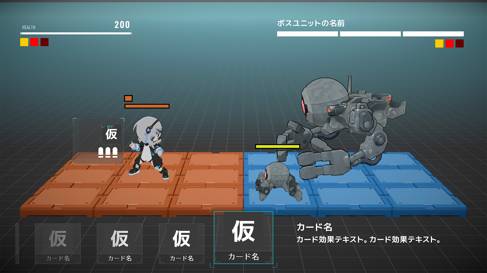
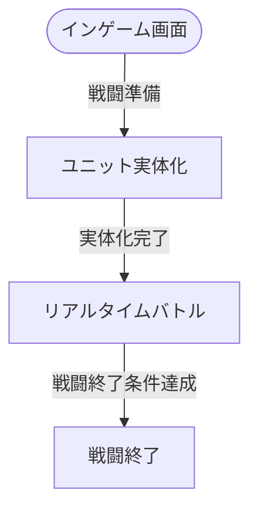

# インゲーム画面

## 概要

バトルの実行基盤となる画面。 
バトルフィールド、戦闘ユニット、バトルUIを提供する。 
InGame自体は独立したシーンとして追加ロードされ、クエスト実行画面や戦闘シミュレーション画面から利用される。

バトルはフェーズ分けを行わず、全てリアルタイムで進行する。

> **ゲームルール仕様**: バトルシステムの詳細は [ゲームルール仕様書](../../game-rules/spec-index.md) を参照

---

## モックアップ

### モブ戦

### ボス戦

---

## フロー

---

## 操作・遷移一覧

インゲーム画面は他の画面から追加ロードされるシーンであり、自身からの画面遷移は持たない。
ロード/アンロードは利用元の画面が制御する。

| 利用元 | 備考 |
|--------|------|
| [クエスト実行画面（非公開資料）](../../private-notice.md) | クエスト中のバトル実行 |
| [戦闘シミュレーション画面（非公開資料）](../../private-notice.md) | カードデッキ編集プレビューのバトル実行 |

操作はコントローラー/キーボードによる直接入力で行う。画面上のボタンUIは配置しない。 
プレイヤー操作の入力マッピングは [プレイヤーユニット — 操作一覧](../../game-rules/battle/spec-piece-player.md#操作一覧) を参照。

---

## UI要素一覧

### 固定UI — 常時

| 要素名 | 位置 | 説明 |
|--------|------|------|
| プレイヤーHPゲージ | 左上 | HP残量をゲージと数値で表示 |
| プレイヤーエンチャント一覧 | 左上（HPゲージ下） | 現在プレイヤーに付与されているエンチャント（バフ・デバフ）を表示。 表示上限は設けず、実装する全てのバフ・デバフが同時に付与されても表示領域に収まる想定 |
| カード予約列 | 下部 | カードが上限枚数まで並ぶ。先頭カードは現在使用可能なカードなので強調表示 |
| 先頭カード詳細 | 下部（カード予約列隣） | カード予約列先頭カード（使用可能カード）のカード名・効果テキスト・威力・発生回数を表示 |

### 固定UI — ボス戦限定

| 要素名 | 位置 | 説明 |
|--------|------|------|
| ボスHPゲージ | 右上 | ボス名とHP残量をゲージで表示（数値なし） |
| ボスエンチャント一覧 | 右上（HPゲージ下） | 現在ボスに付与されているエンチャント（バフ・デバフ）を表示 |

### 追従UI — プレイヤー

| 要素名 | 説明 |
|--------|------|
| 使用可能カード表示 | 現在使用可能なカードを表示 |
| カード使用回数表示 | カード使用回数の残量を表示 |
| 地形効果種別表示 | 現在受けている地形効果の種類を表示 |
| 地形効果蓄積ゲージ | 地形効果の蓄積量を表示 |

### 追従UI — モブエネミー

| 要素名 | 説明 |
|--------|------|
| 敵HPゲージ | HP残量をゲージで表示（数値なし） |

---

## オブジェクト一覧

| 要素名 | 説明 |
|--------|------|
| バトルフィールド | コアフロアブロックとアウターフロアブロックで構成される戦場 |
| コアブロック | バトルフィールドの主要エリア。自陣は赤、敵陣は青の床ブロック。空中ブロックもあるが不可視。 |
| アウターブロック | バトルフィールド外縁のバッファエリア。不可視。 |
| 戦闘ユニット | アバター表示・移動・カード発動アニメーションを持つユニットオブジェクト |

---

## デバッグ機能

| 機能 | 説明 |
|------|------|
| 強制勝利 | 実行時、進行中のバトルを即座に勝利扱いで終了させる |
| 強制敗北 | 実行時、進行中のバトルを即座に敗北扱いで終了させる |
| 戦闘ユニットへのダメージ/回復付与 | 指定した戦闘ユニット（プレイヤー／エネミー／ボス）に任意量のダメージまたは回復を与える |
