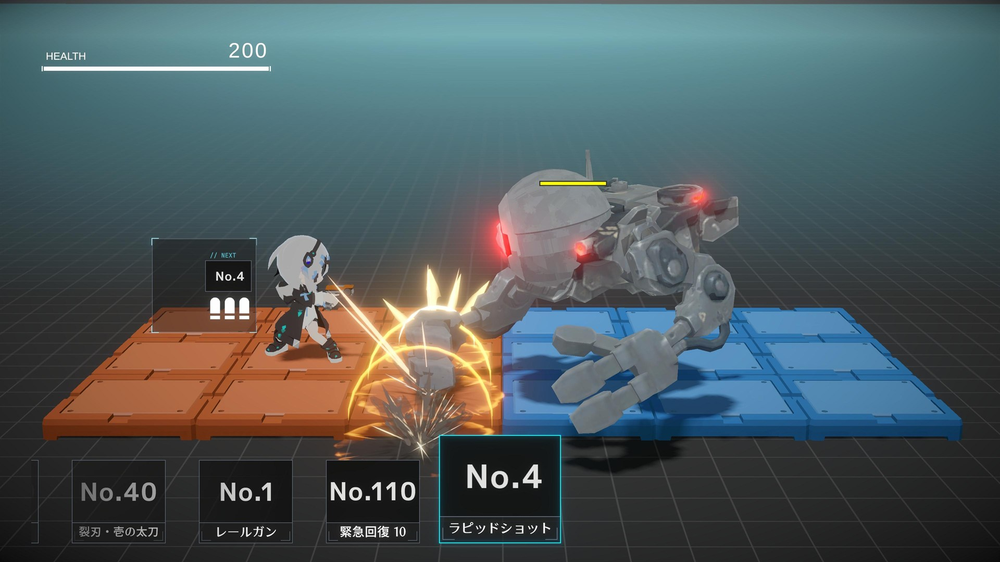
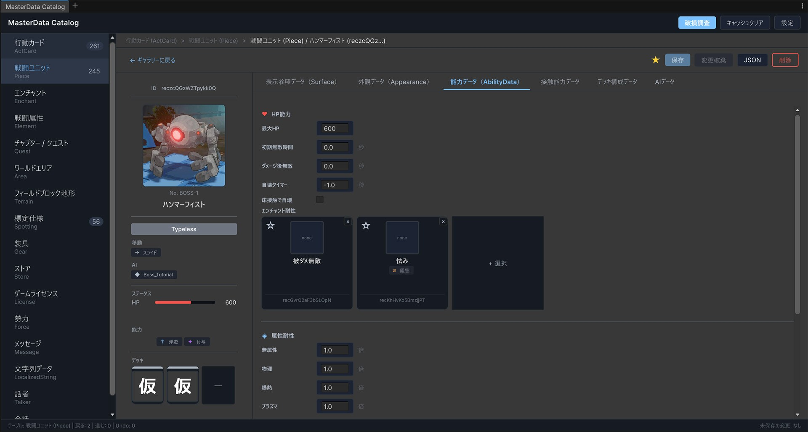
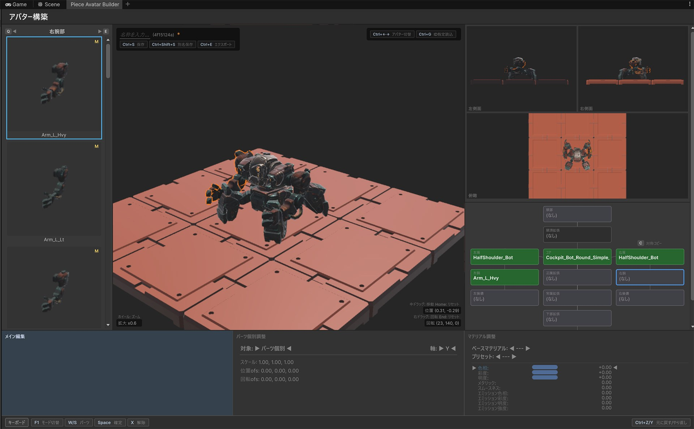

# ギャラリー

開発中ゲームの画面と、制作効率化のために内製した開発ツールを掲載します。

## ゲーム本編

[動画を開く](videos/game-battle.mp4)

## マスターデータ編集ツール

マスターデータをグラフィカルに編集するためのツールです。 
汎用的な表形式ツールでは表現しづらいPJ固有のデータを編集するため作成しました。

Unity上で動作しているため、登録アセットの実在チェックなど、関連データの把握や編集状態の確認をしやすくなっています。

[動画を開く](videos/master-data-catalog.mp4)

## エネミー作成ツール

エネミーとして登場させるメカを作成するためのツールです。 
パーツ構成や見た目を確認しながら調整できるようにし、ゲーム内に登場するユニット制作を効率化しています。

[動画を開く](videos/piece-avatar-builder.mp4)
