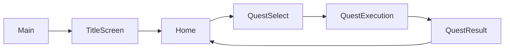

# 実装サンプル

本ディレクトリには、技術設計資料で紹介した内容を Unity プロジェクトとして具体化したサンプルを配置しています。 
アーキテクチャ、依存関係の分離、UI と Model の接続方法など、設計資料で説明した方針がコード上でどのように表れるかご確認いただければと思います。

## ゲームの起動方法

1. Unity Hub から `samples/ArchitectureSample` を Unity 6（6000.4.1f1）で開く
2. `Assets/Hecres/Project/App.Main/SequenceRoot/Runtime/AddressableAssets/Local/Scenes/Main.unity` を開く
3. Unity Editor の Play ボタンで再生する

`Main` シーンから開始すると、タイトル画面を起点に各画面へ遷移します。

## 画面遷移

## 本サンプルで確認できる技術

| 観点 | 確認できること | 主な確認箇所 |
|---|---|---|
| クリーンアーキテクチャ | Domain / UseCase / Presentation / CompositionRoot などの責務分離と依存方向 | - [`App.Main`](ArchitectureSample/Assets/Hecres/Project/App.Main/) - [`Foundation.MasterData`](ArchitectureSample/Assets/Hecres/Project/Foundation.MasterData/) - [`Foundation.Networking`](ArchitectureSample/Assets/Hecres/Project/Foundation.Networking/) |
| DDD | ドメイン層を中心にした Entity / ValueObject / Repository interface などの表現 | - [`QuestData.cs`](ArchitectureSample/Assets/Hecres/Project/Foundation.MasterData/Domain/Runtime/Scripts/Entities/DataRows/Quests/QuestData.cs) - [`QuestDataId.cs`](ArchitectureSample/Assets/Hecres/Project/Foundation.MasterData/Domain/Runtime/Scripts/ValueObjects/DataRows/Quests/DataTypes/QuestDataId.cs) - [`IProjectMasterDataGetter.cs`](ArchitectureSample/Assets/Hecres/Project/Foundation.MasterData/Domain/Runtime/Scripts/Repositories/Managers/Interfaces/IProjectMasterDataGetter.cs) |
| MVRP | Model と View を Presenter が仲介し、UI 入力や状態反映を分離する構成 | - [`MvrpLinker.cs`](ArchitectureSample/Assets/Hecres/Core/HecUnity/Presentation/Runtime/Scripts/DesignPatterns/Mvrp/MvrpLinker.cs) - [`MvrpPresenterBase.cs`](ArchitectureSample/Assets/Hecres/Core/HecUnity/Presentation/Runtime/Scripts/DesignPatterns/Mvrp/Presenters/Bases/MvrpPresenterBase.cs) - [`TitleScreenUiPresenter.cs`](ArchitectureSample/Assets/Hecres/Project/App.Main/Presentation/Runtime/Scripts/AppSequences/SceneSequences/TitleScreen/Presenters/TitleScreenUiPresenter.cs) |
| DI | VContainer による依存登録と、シーン単位の Composition Root | - [`TitleScreenLifetimeScope.cs`](ArchitectureSample/Assets/Hecres/Project/App.Main/CompositionRoot/Runtime/Scripts/AppSequences/SceneSequences/TitleScreen/TitleScreenLifetimeScope.cs) - [`ProjectSceneSequenceLifetimeScopeBase.cs`](ArchitectureSample/Assets/Hecres/Project/App.Main/CompositionRoot/Runtime/Scripts/AppSequences/SceneSequences/Bases/ProjectSceneSequenceLifetimeScopeBase.cs) - [`DummyProjectMasterDataManager.cs`](ArchitectureSample/Assets/Hecres/Project/Foundation.MasterData/Infrastructure/Runtime/Scripts/Managers/DummyProjectMasterDataManager.cs) |
